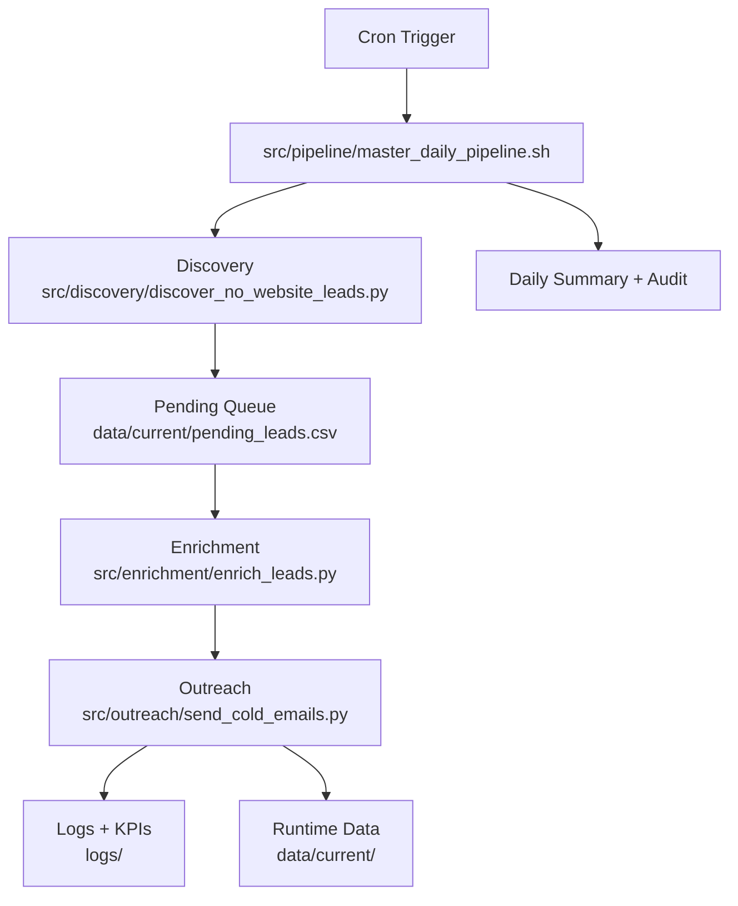

# Daily Leads Pipeline

Local pipeline that discovers no-website leads, enriches contact emails, and sends outreach with daily caps.

## Pipeline Diagram



## Setup Instructions

1. Create and activate your virtual environment.

```bash
cd /Users/alexcahn/Scripts/Daily_Leads
python3 -m venv /Users/alexcahn/Scripts/.venv
source /Users/alexcahn/Scripts/.venv/bin/activate
```

2. Install dependencies.

```bash
pip install -r requirements.txt
```

3. Create `.env` in the repo root and set required secrets/overrides.

4. Verify config defaults in `config/config.yaml`.

5. Run a safe dry-run check.

```bash
cd /Users/alexcahn/Scripts/Daily_Leads
DRY_RUN=true PIPELINE_DELAY_BETWEEN_RUNS=1 ./src/pipeline/master_daily_pipeline.sh
```

## Environment Variables

Create `.env` with the values below. Any variable not set falls back to config/default behavior where supported.

### Required Credentials

- `DAILY_LEAD_EMAIL_SENDER`
- `DAILY_LEAD_EMAIL_PASS`
- `REPLY_NOTIFY_TO`
- `GOOGLE_PLACES_API_KEY`
- `SERPER_API_KEY`
- `HUNTER_API_KEY`

### Throughput and Scheduling

- `DAILY_EMAIL_TARGET`
- `ENRICH_BUFFER_MULTIPLIER`
- `EXPECTED_SENDS_PER_PAIR`
- `MAX_PAIRS_PER_RUN`
- `MAX_ENRICH_LEADS_PER_PAIR`
- `ZERO_SEND_STREAK_STOP`
- `PIPELINE_DELAY_BETWEEN_RUNS`

### Lead Quality and Targeting

- `LEAD_SCORE_THRESHOLD`
- `PRE_ENRICH_SCORE_FILTER`
- `STARTUP_PRIORITY`
- `STARTUP_SCORE_BOOST`
- `STARTUP_MAX_AGE_YEARS`
- `STARTUP_EXCLUDE_TECH`
- `STARTUP_HINT_KEYWORDS`
- `STARTUP_TECH_EXCLUDE_KEYWORDS`

### Discovery and Enrichment Controls

- `DISCOVERY_PROVIDER`
- `GOOGLE_DISCOVERY_SEARCH_CALLS`
- `GOOGLE_DISCOVERY_TARGET_LEADS`
- `GOOGLE_DETAILS_FALLBACK_LIMIT`
- `CACHE_TTL_DAYS`
- `CACHE_MAX_MB`

### Sender and Suppression Behavior

- `BLOCK_GENERIC_INBOXES`
- `BLOCKED_RECIPIENT_DOMAINS_EXTRA`
- `SKIP_REPLY_CHECK_CLEANUP`
- `UNSUBSCRIBE_FOOTER`

### Adaptive Pairing

- `ADAPTIVE_PAIR_SCHEDULING`
- `ADAPTIVE_LOOKBACK_RUNS`
- `ADAPTIVE_MIN_EXPECTED_SENDS_PER_PAIR`
- `ADAPTIVE_MAX_EXPECTED_SENDS_PER_PAIR`
- `ADAPTIVE_SAFETY_FACTOR`

### Cost and Monitoring

- `GOOGLE_TEXT_SEARCH_ENTERPRISE_PRICE_PER_1000`
- `GOOGLE_PLACE_DETAILS_ENTERPRISE_PRICE_PER_1000`
- `GOOGLE_MONTHLY_PROJECTED_COST_ALERT_THRESHOLD`
- `API_SUCCESS_RATE_ALERT_THRESHOLD`
- `EFFICIENCY_MIN_EMAILS_PER_API_CALL`
- `LOG_ARCHIVE_RETENTION_DAYS`
- `LOG_ROTATE_MAX_MB`
- `STRUCTURED_LOGGING_ENABLED`

### Runtime and Testing

- `DRY_RUN`

## Daily Cron Example

```cron
0 7 * * * cd /Users/alexcahn/Scripts/Daily_Leads && /Users/alexcahn/Scripts/Daily_Leads/src/pipeline/master_daily_pipeline.sh >> /Users/alexcahn/Scripts/Daily_Leads/logs/pipeline.log 2>&1
```

This runs the pipeline every day at 07:00 local time and appends output to `logs/pipeline.log`.

## Run Manually

```bash
cd /Users/alexcahn/Scripts/Daily_Leads
./src/pipeline/master_daily_pipeline.sh
```

## Tests

```bash
cd /Users/alexcahn/Scripts/Daily_Leads
pytest -q
```

Inbound replies are automatically processed through Gmail IMAP:

| Step | Action |
| --- | --- |
| 🧾 1 | Parse INBOX for replies from the past 7 days |
| 📓 2 | Log sender, subject, and snippet to `data/replies.csv` |
| 🧹 3 | Remove those addresses from `data/sent_log.csv` |
| 🚫 4 | Auto-add negative replies (unsubscribe/stop/not interested) to `data/suppressions.csv` |
| 📧 5 | Send a notification email with a concise summary |

Example email notification:

```text
Subject: [Pipeline] 2 new replies

New replies detected:

- john@evergreenhvac.com | Re: Quick question about Evergreen HVAC | "Hi Alex, let’s chat next week about pricing."...
- info@blueflame.com | Re: Website for Blue Flame Heating? | "Sure — send me some examples!"...

Total replied addresses: 2
```

## 🧠 Core Scripts

| Script | Description |
| --- | --- |
| `src/discovery/discover_no_website_leads.py` | 🔎 Finds likely no-website leads via Google Places API (New) by default (Serper fallback) and writes `leads_<city>_<service>_NO_WEBSITE_<date>.csv`. |
| `src/enrichment/enrich_leads.py` | 🔍 Enriches discovery output, re-checks live websites, and verifies contact emails via Serper and Hunter APIs. |
| `src/outreach/send_cold_emails.py` | ✉️ Sends cold emails with score-prioritized queue processing (highest `lead_score` first), deferred-lead carryover (`data/pending_leads.csv`), dynamic fields, rotating subject lines, and optional reply-cleanup skip (`SKIP_REPLY_CHECK_CLEANUP`). |
| `daily_summary_report.py` | 📊 Generates a daily overview of lead counts and campaign performance. |

## 🗃 Data Outputs 📑

| File / Folder | Description |
| --- | --- |
| `data/leads_<city>_<service>_NO_WEBSITE_<date>.csv` | Discovery/enrichment output used by outreach |
| `data/daily_sent/daily_sent_<date>.csv` | Daily send ledger used to enforce email caps (email, lead_score, timestamp, source file) |
| `data/sent_log.csv` | Rolling record of all recipients already emailed (email, lead_score, timestamp, source file) |
| `data/replies.csv` | Archived reply summaries (sender, subject, snippet, date) |
| `data/suppressions.csv` | Suppressed addresses (manual and auto from negative replies) |
| `data/pending_leads.csv` | Deferred leads to retry next run (always present; includes `lead_score` for prioritization) |
| `data/cache/` | Cached API responses used to reduce repeat Google Places/Serper/Hunter calls |
| `logs/daily_kpi.csv` | Run-by-run KPIs: pairs, sent, replies, quota remaining |
| `logs/run_metrics/run_metrics_<timestamp>.json` | Per-run API counters used in summary email |
| `logs/archive/<timestamp>/run_metrics_*.json` | Archived run metrics moved out of the live logs root each new run |
| `logs/` | Process and cron output logs |

Archive retention notes:

- `LOG_ARCHIVE_RETENTION_DAYS` controls cleanup of old `logs/archive/*` folders.
- Default is `60` days if unset or invalid.
- Set `0` to disable automatic pruning.

## 🗺 Discovery Provider Behavior

- Default provider is `google_places` when `GOOGLE_PLACES_API_KEY` is set; otherwise it falls back to `serper`.
- You can explicitly set `DISCOVERY_PROVIDER=serper` or `DISCOVERY_PROVIDER=google_places`.
- Google Places discovery uses Places API (New) Text Search + place details and skips businesses with a discovered `websiteUri`.
- `GOOGLE_DISCOVERY_SEARCH_CALLS` controls how many paginated Places Text Search calls are made per city/service pair.
- `GOOGLE_DISCOVERY_TARGET_LEADS` stops per-pair discovery once enough no-website leads are collected.
- `GOOGLE_DETAILS_FALLBACK_LIMIT` caps extra Place Details lookups when Text Search rows omit `websiteUri`.
- Discovery cache keys include versioning and API-key fingerprinting to avoid stale cross-key false hits.

### How to switch providers (quick reference)

One-off run override:

```bash
cd /Users/alexcahn/Scripts/Daily_Leads/src
DISCOVERY_PROVIDER=google_places GOOGLE_DISCOVERY_SEARCH_CALLS=4 ./master_daily_pipeline.sh

cd /Users/alexcahn/Scripts/Daily_Leads/src
DISCOVERY_PROVIDER=serper ./master_daily_pipeline.sh
```

Persistent default in `.env`:

```env
# Force Google Places (New)
DISCOVERY_PROVIDER=google_places
GOOGLE_DISCOVERY_SEARCH_CALLS=4
GOOGLE_DISCOVERY_TARGET_LEADS=12
GOOGLE_DETAILS_FALLBACK_LIMIT=8

# OR force Serper
# DISCOVERY_PROVIDER=serper
```

If `DISCOVERY_PROVIDER` is unset, the pipeline auto-selects `google_places` when `GOOGLE_PLACES_API_KEY` exists, otherwise `serper`.

## 🧾 Pending Leads Queue

- `send_cold_emails.py` reads `data/pending_leads.csv` first, then current-day file rows.
- Rows are deduped by recipient email before send decisions.
- Deferred/retryable rows (for example, domain-cap overflow or transient send errors) are carried forward to `pending_leads.csv`.
- Non-retryable policy skips are pruned and not re-queued.
- Queue file is always written each run (header-only when empty).

## ✅ Testing

Run the test suite:

```bash
cd /Users/alexcahn/Scripts/Daily_Leads
/Users/alexcahn/Scripts/.venv/bin/python -m pytest
```

The suite includes:

- Unit tests for sender, enrichment, discovery, and summary modules
- Parameterized edge-case tests for filename and parsing behavior
- Parameterized contact-name matrix tests (valid names vs handle-like local parts)
- Rendered-email regression tests (subject/body output stability)
- Subject-format regression tests (no double-comma town formatting)
- Dry-run integration validation of master pipeline KPI output

CI runs the same suite on push and pull request via `.github/workflows/tests.yml`.

## 🚀 Go-Live Ramp Plan

Use a staged rollout to protect sender reputation while the domain warms up.

### Week 1 (stability mode)

```env
DAILY_EMAIL_TARGET=10
ENRICH_BUFFER_MULTIPLIER=2
LEAD_SCORE_THRESHOLD=3
MAX_EMAILS_PER_DOMAIN=1
BLOCK_GENERIC_INBOXES=true
PRE_SEND_VALIDATE_EMAILS=true
CACHE_TTL_DAYS=7
EXPECTED_SENDS_PER_PAIR=5
MAX_PAIRS_PER_RUN=10
```

### Week 2+ (gradual scale)

- Increase `DAILY_EMAIL_TARGET` slowly: `20` → `35` → `50`
- Keep `MAX_EMAILS_PER_DOMAIN=1` until bounce/blocks remain low for several days

### Daily health checks

- `logs/daily_kpi.csv` → sent/replies/quota trend
- `logs/email.log` → `[BOUNCE]`, `[VALIDATION]`, `[DOMAIN-CAP]`, `[SUPPRESS]`
- `data/suppressions.csv` → ensure bounced/problematic addresses are being excluded

### Lower API usage (quick wins)

- Keep `PRE_ENRICH_SCORE_FILTER=true`.
- Increase `LEAD_SCORE_THRESHOLD` to `3` for stricter pre-enrich gating.
- Reduce `ENRICH_BUFFER_MULTIPLIER` from `2` to `1` if calls are still high.
- Use `MAX_PAIRS_PER_RUN=1`–`2` during warm-up while tuning quality.

## 🛡 Best Practices

- ✨ Use App Passwords and enable Gmail IMAP
- 📦 Rotate API keys every 90 days (Serper / Hunter)
- 🗂 Archive old logs monthly
- 🚫 To pause outreach, comment out the second cron job

```bash
# pause cold emails
# 30 7 * * * cd ~/Scripts/Daily_Leads/src ... send_cold_emails.py
```

## 🧾 Version History 📅

| Date | Update |
| --- | --- |
| 2026-02-22 | Added subject rotation, random send delays, Gmail reply processing, automatic cleanup, and reply notification emails. |
| 2026-02-26 | Added dry-run mode, filename consistency fixes, and summary metric corrections. |
| 2026-02-26 | Added daily send cap, quota-aware enrichment, suppression list support, and KPI logging. |
| 2026-02-26 | Added pytest suite with unit and dry-run integration coverage. |
| 2026-02-26 | Added dynamic pair scheduling, lead scoring, API caching/pruning, CI workflow, and API-call totals in summary email. |
| 2026-02-27 | Improved copy quality: high-signal opener filtering, business-personalized fallback opener, and cleaner CTA/footer defaults. |
| 2026-02-27 | Added per-lead service inference, subject fallback for unknown names, conservative contact-name detection with likely-first-name allowlist, and brand-aware business casing. |
| 2026-02-27 | Added sender regression tests for rendered output, contact-name matrix, and subject/town formatting stability. |

---

❤️ Built by Alex Cahn / ZBA Digital — streamlining local lead generation through automation.
